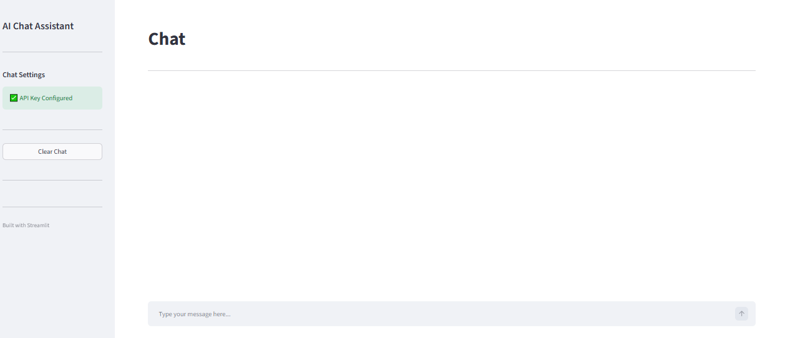
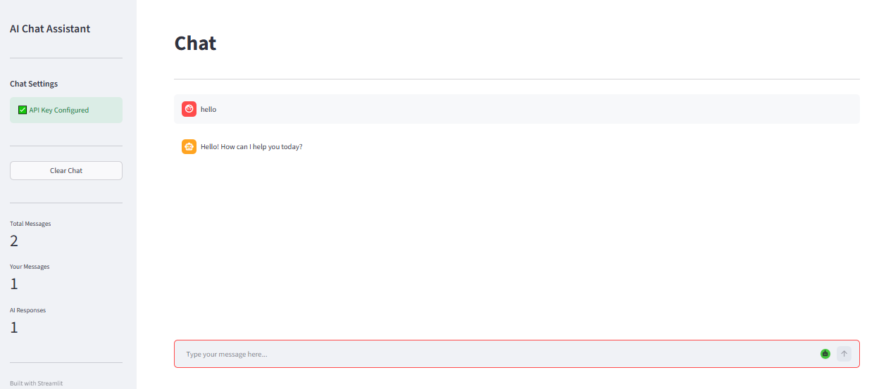
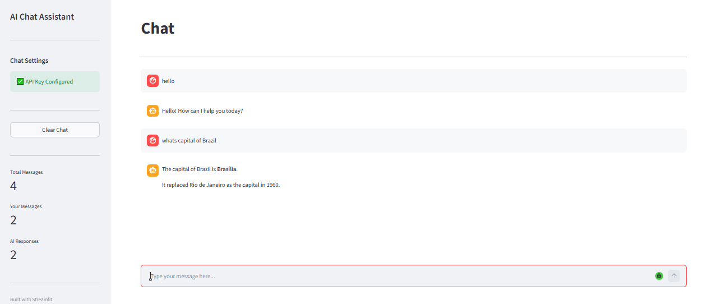

# AI Chat Assistant

A conversational AI chatbot built using Python, Streamlit, and the Google Gemini API. The application provides a clean chat interface with session-based conversation memory and a modular backend for handling LLM interactions.

The goal of this project was to explore LLM integration, prompt handling, and application architecture while building a practical chatbot from scratch.

---

## Features

- Conversational chat interface built with Streamlit
- Google Gemini API integration
- Session-based conversation memory
- Markdown support for AI responses
- Modular backend architecture
- Environment-based configuration using `.env`
- Docker support for containerized deployment
- Basic error handling for invalid input and API failures

---

## Tech Stack

| Category | Technologies |
|----------|--------------|
| Language | Python 3 |
| Frontend | Streamlit |
| Backend | Python |
| LLM | Google Gemini API |
| Configuration | python-dotenv |
| Containerization | Docker |
| Version Control | Git & GitHub |

---

## Project Structure

```
ai-chat-assistant/
│
├── backend/
│   ├── __init__.py
│   ├── api.py
│   ├── config.py
│   ├── llm.py
│   └── memory.py
│
├── screenshots/
│
├── app.py
├── Dockerfile
├── docker-compose.yml
├── requirements.txt
├── .env.example
├── README.md
└── LICENSE
```

---

## Installation

Clone the repository

```bash
git clone https://github.com/Manas2904/ai-chat-assistant.git
cd ai-chat-assistant
```

Create a virtual environment

```bash
python -m venv venv
```

Activate it

Windows

```bash
venv\Scripts\activate
```

Linux/macOS

```bash
source venv/bin/activate
```

Install dependencies

```bash
pip install -r requirements.txt
```

Create a `.env` file

```env
GOOGLE_API_KEY=YOUR_API_KEY
```

Run the application

```bash
streamlit run app.py
```

---

## How It Works

1. The user enters a prompt through the Streamlit interface.
2. The conversation history is maintained using Streamlit session state.
3. User messages are forwarded to the Gemini model.
4. The generated response is displayed in the chat interface.
5. Previous messages remain available during the active session, allowing contextual conversations.

---

## Screenshots

### Home



### Chat Conversation 1



### Chat Conversation 2



---
## Future Improvements

- Streaming responses
- Multiple LLM provider support
- Persistent conversation history
- File upload and document chat
- Retrieval-Augmented Generation (RAG)
- User authentication

---

## License

This project is licensed under the MIT License.
